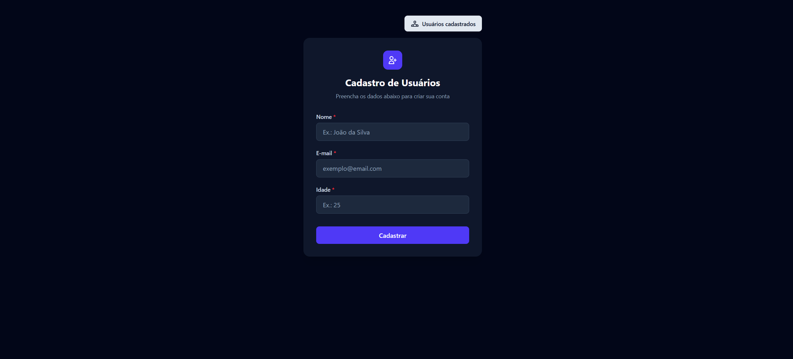
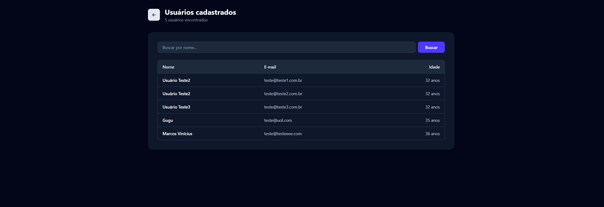

# react-node-fullstack-app

Full-stack monorepo project with React on the client and Node.js on the server, focused on API development, backend fundamentals, and full-stack architecture.

## Goal

The goal of this project is to strengthen backend development skills, especially Node.js, API development, databases, and full-stack application architecture.

## Tech Stack

### Backend
- Node.js
- Express
- Prisma (MongoDB)

### Frontend
- React
- Vite
- Tailwind CSS
- React Router
- React Hook Form
- Zod
- TanStack Query (React Query)

## Project Structure

```
react-node-fullstack-app/
├── client/    # React application (Vite)
│   └── src/
│       ├── api/          # React Query services (userService)
│       ├── components/   # Pages and form components
│       └── validation/   # Zod schemas
├── server/    # Node.js API (Express + Prisma)
├── docs/      # Documentation and screenshots
├── .gitignore
└── README.md
```

## Running Locally

### Server

```bash
cd server
npm install
npm run db:generate
npm run db:push
npm run dev
```

The API runs on `http://localhost:3000`.

### Client

```bash
cd client
npm install
npm run dev
```

The client runs on `http://localhost:5173`.

## Screenshots

### User registration form



### Registered users list



## Features

- User registration form with `name`, `email`, and `age` fields (Zod + React Hook Form validation).
- Registered users displayed in a full-page table with search by name (TanStack Query + backend query params).
- Auto-refresh of the user list after a new registration (query invalidation).

## Learning Journey

Development notes and technical concepts are documented as the project evolves.

## Credits

Project initially based on a tutorial. Additional features, refactoring, and documentation were developed as part of personal studies.
